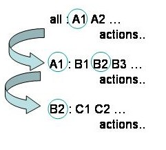

[Prev](hello.md) [Next](variables.md)

# Funadamental Concepts: Rules, Targets and Dependencies

Makefiles are composed of rules and variables. We'll see some variables soon.
For now, let’s just look at some rules. A rule in a makefile has the general
form:

```make
Target : dependencies
	Action1
	Action2
	...
```

Note there is a TAB at the start of any Action lines. You need one. Don't ask, don't ask. It’s just the way it is!

A rule can have many dependencies and one or more actions.

A rule will trigger if the dependencies are satisfied and they are ‘newer’ than
the target. If the rule is triggered, the actions will be performed. This all
sounds rather abstract, so let’s consider something more concrete. Take a look
at the contents of Makefile in our example. In particular, the rule:

```make
hello_world.o : hello_world.c
	gcc –c hello_world.c –o hello_world.o
```

So, our target here is hello_world.o, our dependency is hello_world.c and our
action is to use gcc to create an object file from the source code. Our
dependency is satisfied, since the file `hello_world.c`§ exists. The file
`hello_world.o` does not exist. In this case the rule will trigger and
compilation action will be performed. If the file `hello_world.o` did exist, make
would compare the date-stamps on the files `hello_world.o` and `hello_world.c`. If
the source code proved to be newer than object code, the file `hello_world.o`
would be updated using the specified action, i.e. `gcc` would be invoked again.

We see a similar pattern in the rule:

```make
hello_world.exe : hello_world.o
	gcc hello_world.o –o hello_world.exe
Lastly, but not least we have:

all : hello_world.exe
```

This is a rule with a null action. It's only use is to specify a dependency.

OK, how does make read a makefile?

When calling make in its default mode, it will look for a file called Makefile
(or makefile) in the current directory and start reading it from the top down.
It will read down until it finds the first rule and look to see if the
dependencies are satisfied. If the dependencies are not satisfied, it will look
for a rule, with a target matching the missing dependency, and so on. In this
way, make chains down a sequence of rules until it finds a satisfied dependency
and then will wind back up to its starting point, performing all the specified
actions along the way.



For our simple makefile, the 'all' rule is first. The dependency is
unsatisfied, but there is a rule with `hello_world.exe` as a target. The
dependency on this second rule (`hello_world.o`) is also missing, but the
dependency on the thrid rule is satisfied (the file `hello_world.c` exists). The
associated action is performed, and hello_world.o is created. Winding back up
the chain, the other rules can now also trigger `hello_world.exe` is created.
Hurrah!

Before we leave this example, there are two more rules to look at—the clean and
spotless rules. These tidy up any files we created using the makefile. It is
good practice, and rather handy, to write these rules. They both have the
questionable distinction of being designated `PHONY`. This indicates that the
targets do not refer to a real file. Since these rules are not part of any
chain, we must call them explicitly by name to trigger them, i.e. make clean,
or make spotless. They have no dependencies and the targets don’t exist, so the
actions will always be triggered.

Note that if you type `make clean` (.o files deleted) and then `make` again, the
source code will be recompiled, despite the presence of a valid executable.
Make will ensure that the whole chain of dependencies is intact.

[Prev](hello.md) [Next](variables.md)
